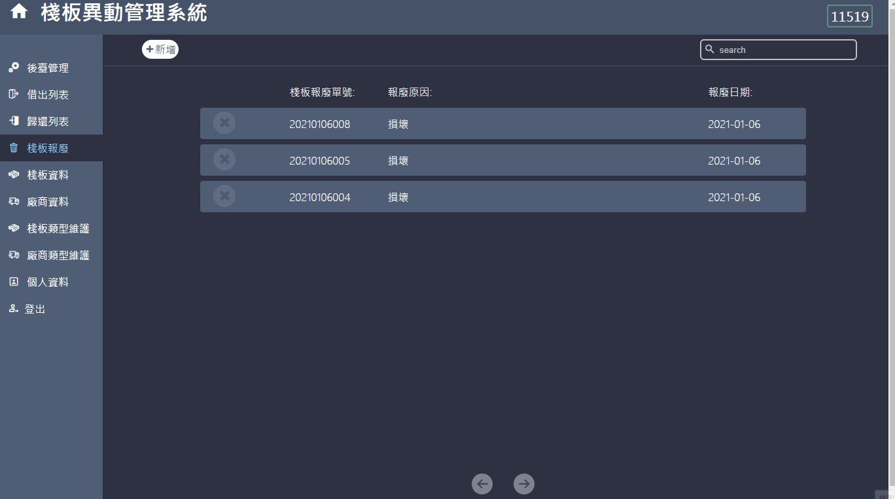

# 棧板異動管理系統
## 說明
原是因工廠的棧板管理問題，故設計一套能方便管理棧板流向與數量的系統。
但因內部原因暫停，故此系統被暫停且不被使用。
經同意製成個人作品。

## 系統需求
#### 硬體
未定
#### 軟體
- JS套件：
    - axios 0.21.1
## 安裝方式
```shell
npm install
```

## 狀態碼
- **400.1** :請求的條件已存在(例如，已被使用的ID)，伺服器不會或不能處理該請求。
- **400.2** :伺服器理解請求，但拒絕執行(例如，請求刪除，但該請求的內容不符合刪除的標準)

## Features
### Login Page
- 輸入錯誤或無權限會顯示錯誤訊息

### Profile Page
- 使用正規表示式判斷密碼是否符合規則，否則會跳出警告訊息並無法更改

### Supplier Page
- 輸入為空或不符合規則會跳出警告訊息
- 刪除確認視窗

### Pallet Page

### Lend Page

### Return Page

### Discard Page

### TypeManage Page
